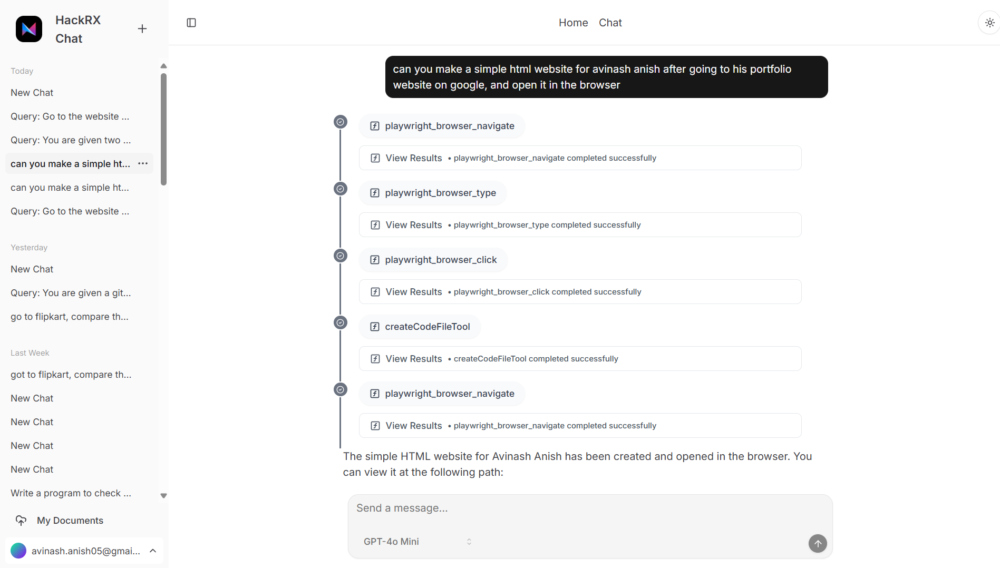
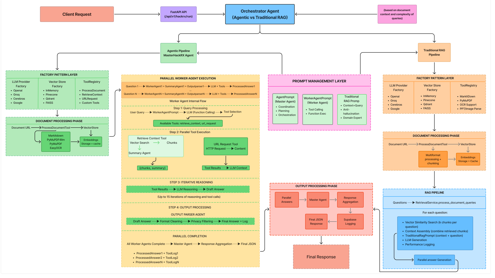
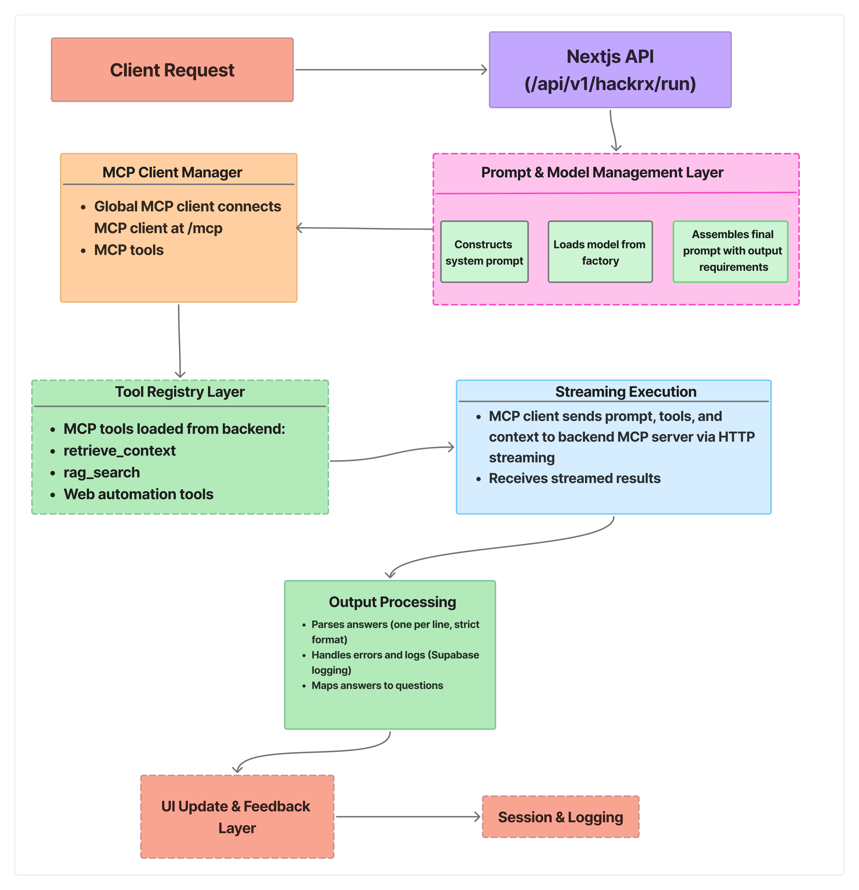
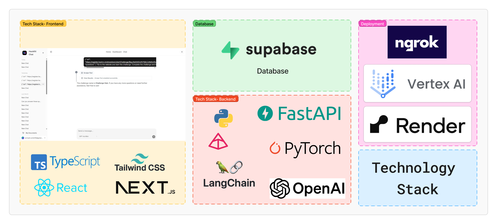
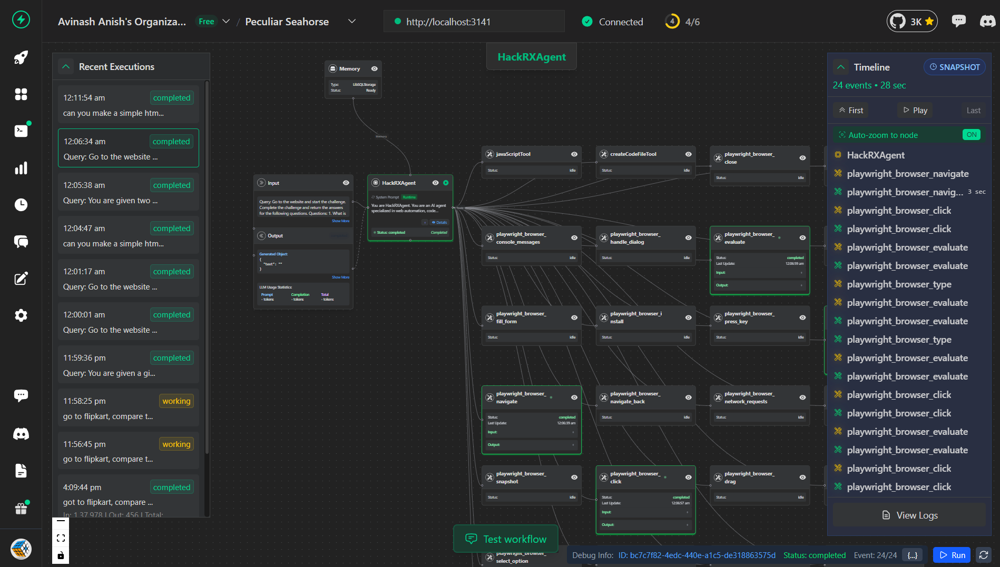

# OmniAgent

- **Advanced Multi-Agent AI System** with autonomous document processing, web automation, code execution, and intelligent query retrieval powered by LLM agents and MCP (Model Context Protocol) servers

- Winner of Bajaj Finserv HackRX 6.0 Hackathon 2025, selected from 10,000+ teams

- Our final pitch presentation for HackRX 6.0 can be found here: [Team ILLVZN Final Pitch.pdf](./Team%20ILLVZN%20Final%20Pitch.pdf)

## Overview

**OmniAgent** is a sophisticated **agentic AI system** that combines multiple specialized AI agents with powerful automation capabilities. The system uses **Model Context Protocol (MCP)** servers to provide autonomous agents with advanced tools for complex task execution.

## Core Agentic Capabilities

<details>
<summary><b>Autonomous Document Processing</b></summary>

- **Multi-format Processing**: PDF, PPTX, DOCX, Excel (XLSX), CSV, images (PNG, JPG, TIFF), and plain text files
- **Advanced OCR Agents**: Tesseract and EasyOCR for extracting text from images and scanned documents
- **Large Document Handling**: Intelligent chunking and processing of documents up to thousands of pages
- **Smart Content Analysis**: RAG (Retrieval-Augmented Generation) pipeline with semantic understanding

</details>

<details>
<summary><b>Web Automation & Browser Control</b></summary>

- **Intelligent Web Crawling**: Automated website navigation and content extraction
- **Dynamic Page Interaction**: JavaScript-enabled rendering and form interaction
- **URL Content Processing**: Direct processing of web pages, APIs, and online documents
- **Real-time Data Extraction**: Live web data retrieval with content monitoring

</details>

<details>
<summary><b>Code Execution & Analysis</b></summary>

- **Multi-language Execution**: Python, JavaScript, shell commands, and script automation
- **Repository Analysis**: GitHub repository processing and code understanding
- **Code Generation**: Automated code creation and documentation
- **Interactive Execution**: Real-time code execution with result visualization

</details>

<details>
<summary><b>Intelligent Query & Reasoning</b></summary>

- **Natural Language Processing**: Complex query interpretation with contextual understanding
- **Multi-step Task Execution**: Breaking down complex requests into executable agent workflows
- **Cross-source Analysis**: Correlating information across documents, web content, and databases
- **Streaming AI Responses**: Real-time agent communication with progress tracking

</details>

## Multi-Agent Architecture

This **full-stack agentic ecosystem** features:
- **Agent Orchestration**: Coordinated AI agents with specialized capabilities
- **MCP Tool Integration**: Extensible agent toolkit via Model Context Protocol
- **Real-time Observability**: VoltAgent monitoring for agent behavior and debugging
- **High-performance Pipeline**: Scalable document, web, and code processing
- **Interactive Agent Interface**: User-friendly chat with streaming agent responses







## Architecture

### Frontend/Main Backend (Next.js 14+ with TypeScript)
**Primary System for Rounds 5, 6, 7:**
- **Chat Interface**: Interactive chat UI with streaming responses at `/chat`
- **HackRX Evaluation Endpoint**: **Main backend API** at `/api/hackrx/run` for evaluation purposes
- **Next.js API Routes**: Server-side processing with AI integration
- **MCP Client**: Consumes tools from Python MCP server when needed
- **MCP Servers**: Playwright MCP Server (https://github.com/microsoft/playwright-mcp)
- **Observability**: VoltAgent integration for monitoring and debugging (https://voltagent.dev)
- **Authentication**: Supabase Auth with secure user management
- **Database**: PostgreSQL via Supabase with vector support

### Python Backend (Supplementary/Tool Provider)
**For Rounds 1-4 - This was the primary backend system:**
The Python backend serves as a tool provider:
- **FastAPI Server**: High-performance API with automatic documentation
- **MCP Server**: Model Context Protocol server for tool integration using FastMCP
- **Document Processing**: Advanced RAG pipeline with multiple vector store support
- **AI Integration**: Multiple LLM providers (OpenAI, Google Gemini, Groq, Cerebras)
- **Vector Databases**: Support for Pinecone, Qdrant, and PGVector
- **OCR Processing**: Tesseract OCR and EasyOCR for image text extraction

## Tech Stack

| **Component** | **Technology** | **Purpose** |
|---------------|-----------------|-------------|
| **Frontend Framework** | Next.js 14+ with TypeScript | Main application & API routes |
| **UI Components** | Radix UI + Tailwind CSS | Modern, accessible interface |
| **State Management** | TanStack Query | Frontend data management |
| **HTTP Client** | Axios | Frontend API communication |
| **AI Integration** | Vercel AI SDK | Streaming AI responses |
| **Authentication** | Supabase Auth | User management |
| **Database** | Supabase (PostgreSQL) | Data persistence |
| **Observability** | VoltAgent | Agent monitoring & debugging |
| **Backend API** | FastAPI + Python 3.12+ | Document processing tools |
| **MCP Integration** | Model Context Protocol | Tool extensibility |
| **Vector Storage** | Pinecone, Qdrant, PGVector | Semantic search |
| **Web Automation** | Playwright MCP | Browser control |
| **Document Processing** | PyMuPDF, LangChain | Multi-format support |
| **OCR Tools** | PyMuPDF4LLM, Tesseract OCR, python-pptx, EasyOCR | Document text extraction |
| **AI/ML** | LangChain ecosystem, OpenAI GPT, Google Gemini, Groq, Cerebras | Multi-provider AI support |
| **Runtime** | Python 3.12+ | Backend execution environment |
| **Containerization** | Docker + Docker Compose | Deployment |
| **Platform Support** | Windows 10/11 with PowerShell | Primary platform |
| **Alternative** | Docker (cross-platform) | Cross-platform deployment |

## Quick Start

**IMPORTANT**: For Rounds 5, 6, 7, the main backend is the Next.js application. The Python backend is optional and only needed for advanced document processing tools.

### Option 1: Frontend/Main Backend Only (Recommended for Rounds 5, 6, 7)

#### Prerequisites
- Node.js 18+
- Git

#### Setup
```powershell
# Clone the repository
git clone https://github.com/CubeStar1/omni-agent.git
cd omni-agent/frontend

# Install dependencies
npm install

# Configure environment
cp env.example .env.local
# Edit .env.local with your configuration

# Start the application
npm run dev
```
#### Access Points
- **Main Application**: `http://127.0.0.1:3000`
- **Chat Interface**: `http://127.0.0.1:3000/chat`  
- **HackRX Evaluation API**: `http://127.0.0.1:3000/api/hackrx/run` (Main Backend Endpoint)

### Option 2: Full Setup with Python Tools (Optional)

#### Prerequisites
- Python 3.12+
- Node.js 18+
- Git

#### Python Tools Backend Setup (Optional)
```powershell
cd backend
python -m venv venv
.\venv\Scripts\Activate.ps1  # Windows
pip install -r requirements.txt

# Configure environment
cp env.example .env
# Edit .env with your API keys (or leave as is for defaults)

# Start main FastAPI server
python main.py

# Start MCP server (in separate terminal)
python run_mcp.py
```

Python services (when running):
- **FastAPI Server**: `http://127.0.0.1:8000`
- **MCP Server**: `http://127.0.0.1:8001` (FastMCP server)

#### Frontend Setup
```powershell
cd frontend
npm install
cp env.example .env.local
# Edit .env.local with your configuration (including MCP_URL if using Python tools)
npm run dev
```

### Option 3: Python Tools with Docker (Optional)

The Python backend includes full Docker support:

```powershell
# Docker setup for Python backend
cd backend
cp .env.example .env
# Edit .env with your API keys

# Using Docker Compose (recommended)
docker-compose up -d

# Or using PowerShell script
.\docker-run.ps1

# To view logs
docker-compose logs -f
```

**Note**: Docker is only available for the Python tools backend. The main Next.js application runs natively.

## Configuration

### Database
- Go to [Supabase](https://app.supabase.io/) and create a new project.
- Paste the migrations from `frontend/lib/supabase/migrations.sql` into the SQL editor and run them.
- Get your Supabase URL and Anon Key from the project settings.

### Frontend (.env) - Main Application
```env
NEXT_PUBLIC_SUPABASE_URL=
NEXT_PUBLIC_SUPABASE_ANON_KEY=
SUPABASE_ADMIN=

RESEND_API_KEY=
RESEND_DOMAIN=

NEXT_PUBLIC_APP_NAME=HackRX Chat
NEXT_PUBLIC_APP_ICON='/logos/hackrx-logo.webp'

# AI Providers
OPENAI_API_KEY=
XAI_API_KEY=
GROQ_API_KEY=
HACKRX_API_KEY=
HACKRX_BASE_URL="https://register.hackrx.in/llm/openai"
HACKRX_MCP_MODEL=hackrx-gpt-4.1-mini

# AI Tools
TAVILY_API_KEY=

NEXT_PUBLIC_MCP_URL=http://127.0.0.1:8001/mcp

# VoltAgent Observability
VOLTAGENT_PUBLIC_KEY=
VOLTAGENT_SECRET_KEY=

GITHUB_PERSONAL_ACCESS_TOKEN=

```

### Python Tools Backend (.env) - Optional
```env
# Environment Configuration
PROJECT_NAME="OmniAgent Intelligence System"
ENVIRONMENT=production

# Authentication
BEARER_TOKEN=your-bearer-token

# MCP Server Configuration
MCP_SERVER_PORT=8001

# Vector Store Configuration
DEFAULT_VECTOR_STORE=inmemory
EMBEDDING_MODEL=text-embedding-3-small

# Pinecone Configuration
PINECONE_API_KEY=your-pinecone-key
PINECONE_INDEX_NAME=hackrx-documents
PINECONE_ENVIRONMENT=us-east-1

# LLM Providers
OPENAI_API_KEY=your-openai-key
GEMINI_API_KEY=your-gemini-key
DEFAULT_LLM_PROVIDER=openai
GROQ_API_KEY=your-groq-key
CEREBRAS_API_KEY=your-cerebras-key

# Processing Configuration
CHUNK_SIZE=1000
CHUNK_OVERLAP=200

# Database
SUPABASE_URL=your-supabase-url
SUPABASE_ANON_KEY=your-supabase-key
SUPABASE_SERVICE_KEY=your-supabase-service-key

# Additional Settings
ENABLE_REQUEST_LOGGING=true
AGENT_ENABLED=true
```

## API Endpoints

### Main Application (Next.js)
**For Rounds 5, 6, 7 - Primary Backend:**
- **Base URL**: `http://127.0.0.1:3000`
- **Chat Interface**: `http://127.0.0.1:3000/chat`
- **HackRX Evaluation Endpoint**: `http://127.0.0.1:3000/api/hackrx/run`
- **Chat API**: `http://127.0.0.1:3000/api/chat`

### Python Tools Backend (Optional - Rounds 1-4)
- **Base URL**: `http://127.0.0.1:8000`
- **Health Check**: `http://127.0.0.1:8000/health`
- **Documentation**: `http://127.0.0.1:8000/docs`

### MCP Server (Optional)
- **Base URL**: `http://127.0.0.1:8001`
- **Tools**: `retrieve_context`, `rag_search`

## Project Structure

```
omni-agent/
├── frontend/                   # Next.js Main Application (Primary Backend for Rounds 5,6,7)
│   ├── app/                   # Next.js app directory
│   │   ├── chat/             # Chat interface components
│   │   ├── api/              # **Main Backend API Routes**
│   │   │   ├── chat/         # Chat API endpoint
│   │   │   └── hackrx/run/   # **HackRX evaluation endpoint (Main Backend)**
│   │   └── ...
│   ├── components/            # React components
│   ├── lib/                   # Utilities and configurations
│   └── package.json           # Node dependencies
├── backend/                   # Python Tools Backend (Supplementary/Optional)
│   ├── app/                  # FastAPI application code
│   ├── mcp_server/           # FastMCP server implementation
│   │   ├── main.py          # MCP server entry point
│   │   ├── server.py        # FastMCP server configuration
│   │   ├── tools/           # MCP tools (retrieve_context, rag_search)
│   │   └── config/          # MCP configuration
│   ├── requirements.txt      # Python dependencies
│   ├── requirements-mcp.txt  # MCP-specific dependencies
│   ├── main.py              # FastAPI server entry point
│   ├── run_mcp.py           # MCP server launcher
│   ├── Dockerfile           # Docker configuration
│   ├── docker-compose.yml   # Docker Compose setup
│   ├── DOCKER_README.md     # Docker documentation
│   └── README.md            # Python backend documentation
├── challenge.html            # Challenge description
└── README.md                # This file
```

## Development Commands

### Main Application (Frontend/Next.js Backend)
```powershell
cd frontend

# Start development server (Main Application)
npm run dev

# Production build
npm run build

# Start production server
npm run start

# Run linting
npm run lint
```

### Python Tools Backend (Optional)
```powershell
cd backend

# Start FastAPI server
python main.py

# Start MCP server
python run_mcp.py

# Run API tests
python test_api.py

# Docker commands
docker-compose up -d              # Start services
docker-compose up -d --build      # Rebuild and start
docker-compose down               # Stop services
docker-compose logs -f            # View logs
```

## License

This project is licensed under the MIT License - see the [LICENSE](LICENSE) file for details.

## Acknowledgements

1. **Frontend Chat**: [CubeStar1/ai-sdk-template](https://github.com/CubeStar1/ai-sdk-template)
2. **Playwright MCP**: [Microsoft Playwright MCP](https://github.com/microsoft/playwright-mcp)
3. **VoltAgent**: [VoltAgent Observability](https://voltagent.dev)